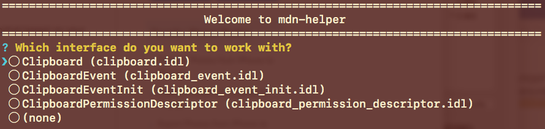

# Building MDN Pages

The `build` command helps you rapidly build JSON and HTML boilerplates for undocumented web platform APIs.

## Before using this command to generate boilerplates:

1. Locate the spec for the platform API you want to document and have it open as you work.
1. Make sure the spec is listed in the KumaScript repo's [SpecData.json](https://github.com/mdn/kumascript/blob/master/macros/SpecData.json) file.

## Build new MDN pages

1. In the directory where you cloned the repo type:

   `npm run build _someSearchString_`

   For example, if you were documenting the `Clipboard` interface you could type any of the following:

   ```bash
   npm run build clip
   npm run build board
   npm run build clipboard
   ```

   MDN Helper searches for interfaces containing the string you entered prompts you with a list.

   

1. It checks for the existence of a JSON file for the interface in the [Browser compatibility Database](https://github.com/mdn/browser-compat-data). If the file does not exist, it creates a blank JSON file.
  * The JSON file contains only null values. You will need to supply version numbers. (I hope to integrate with Confluence in a future release so that whenever possible this information is supplied for you.)
  * You will need to correct the nesting of the JSON and create a pull request to submit it to the database. [JSON Editor Online](http://jsoneditoronline.org/#/) can fix the nesting for you quickly.
  * MDN Helper writes the JSON file to a subfolder of `Desktop/out`.

1. For the interface and each of its members, MDN Helper pings the expected URL as listed in the Browser compatibility Database (if the data exists that is.)

1. If pages are found to be missing for the selected interface, you will be asked questions to gather information needed for the interface. These pages will also be written to `Desktop/out`.

1. In `Desktop/out` open and inspect the files you just created. Add any additional information you feel is needed. Add code examples for every page you created whenever possible.

You are now ready to upload the new files to MDN. Use the `clean` command to [clean up old files](clean-up-old-files).

## Create a JSON file

You can also use the `build` command to create an empty JSON file for the [Browser compatibility Database](https://github.com/mdn/browser-compat-data). To do so, use either the `-j` or `--jsonOnly` flag. For example:

`npm run build clipboard -- -j`

The application flow will be similar to building complete pages, but will end before prompting you for questions. Use this command when you want to have browser compatibility data merged to the database and deployed to MDN before documenting an interface. You would do this so that published pages never have missing compatibility data.

## Clean up old files

After publishing your new MDN pages, you will want to remove them from your output directory. You can do this manually, but MDN Helper provides a command for this. Type the command below and follow the on-screen directions.
